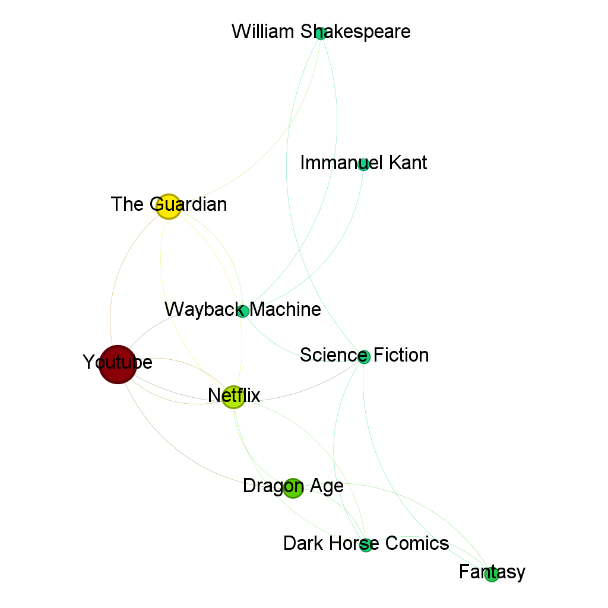

# Studying relationships between classic rpgs using networks

<!DOCTYPE html>
<html lang="pt-BR">
<head>
    <meta charset="UTF-8">
    <meta name="viewport" content="width=device-width, initial-scale=1.0">
    <title>Imagens com Legendas</title>
    
</head>
<body>
    

        
        
Legenda da Imagem 1

    

    

        
        
Legenda da Imagem 2

    

</body>
</html>

