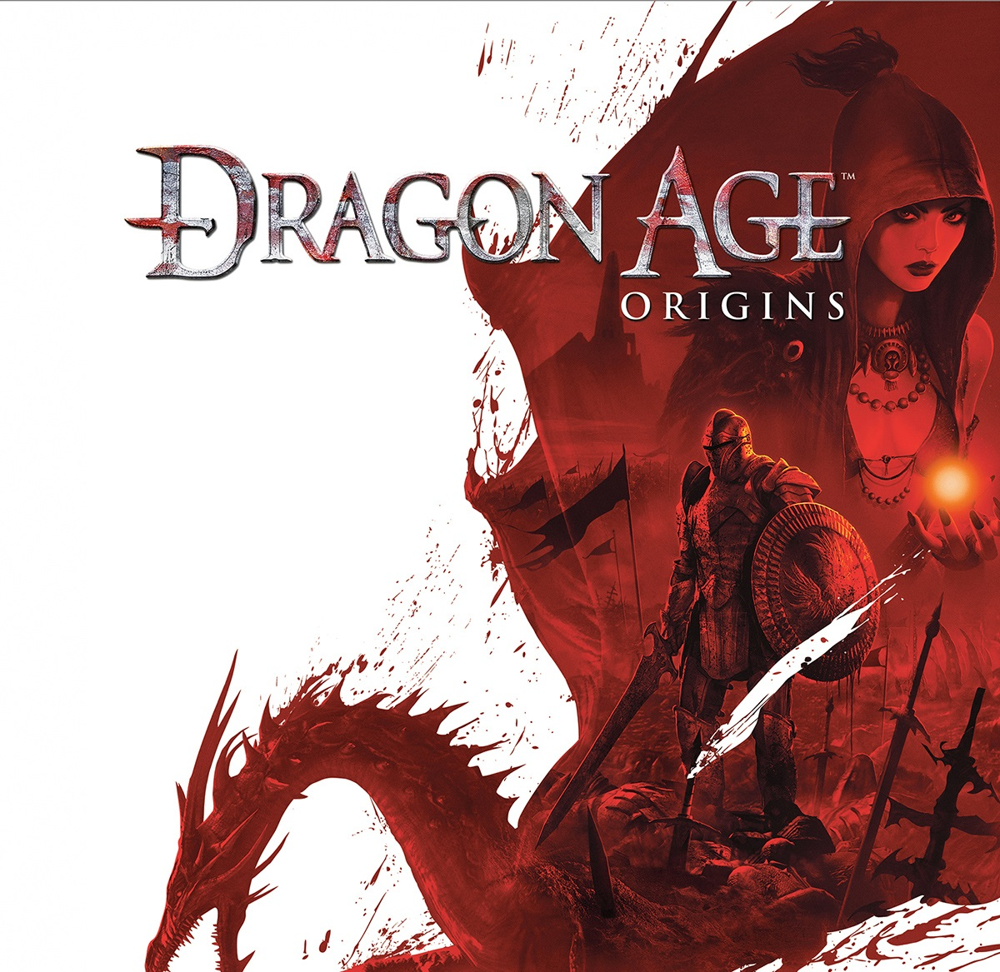
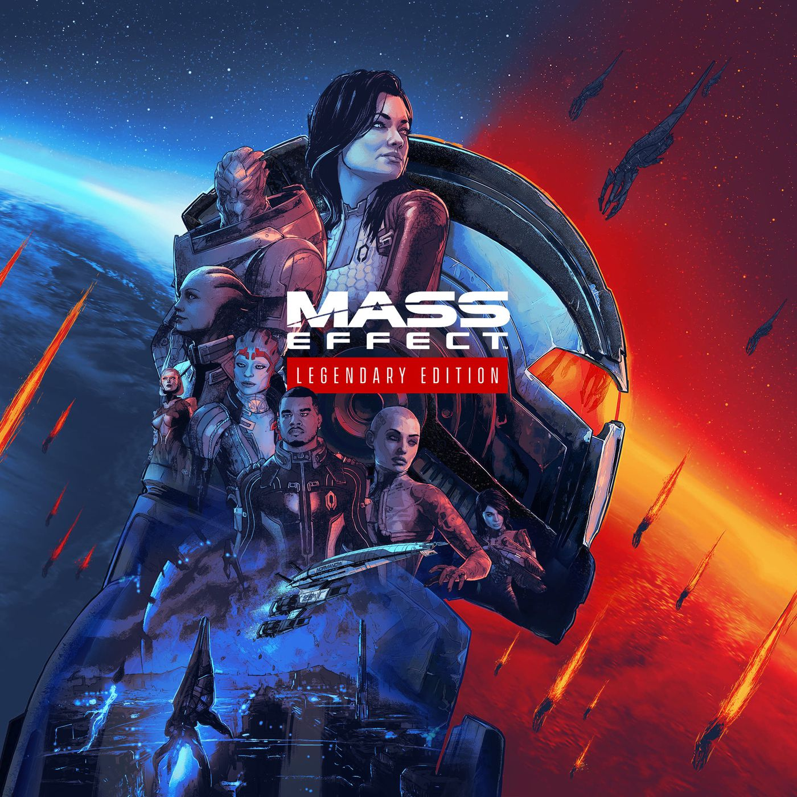
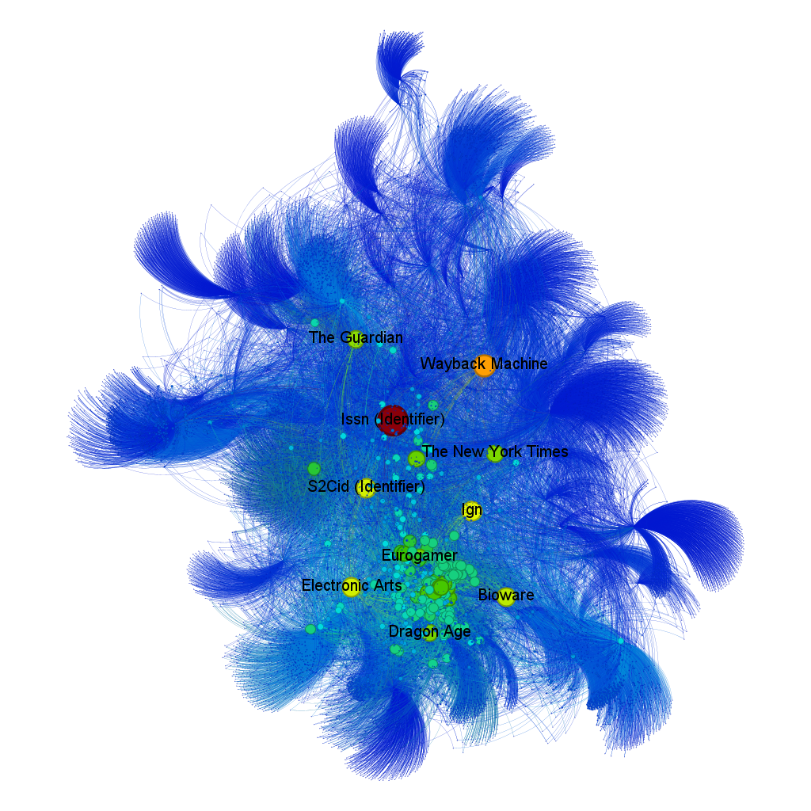
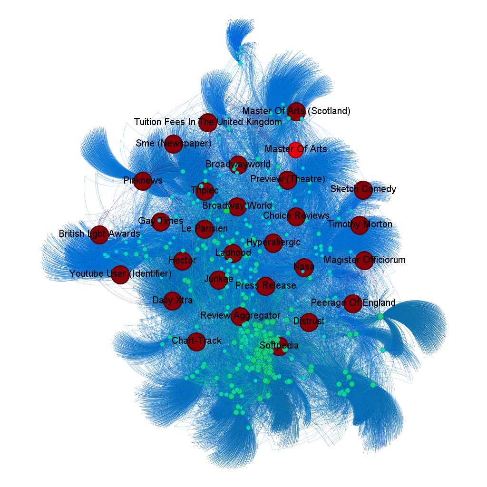
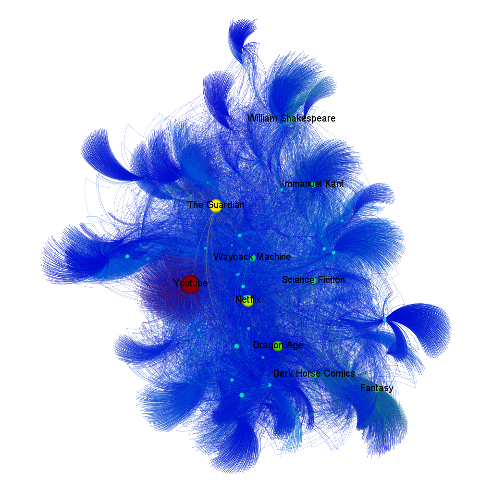
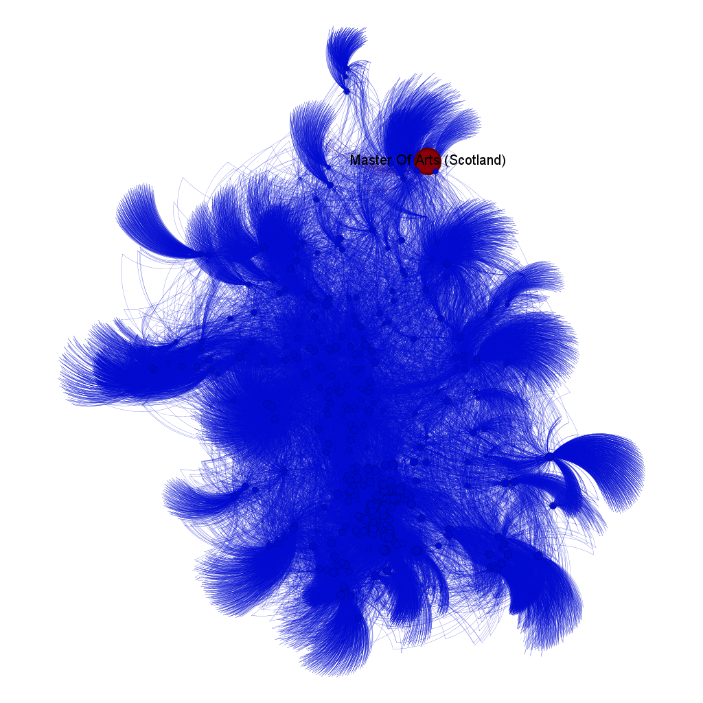
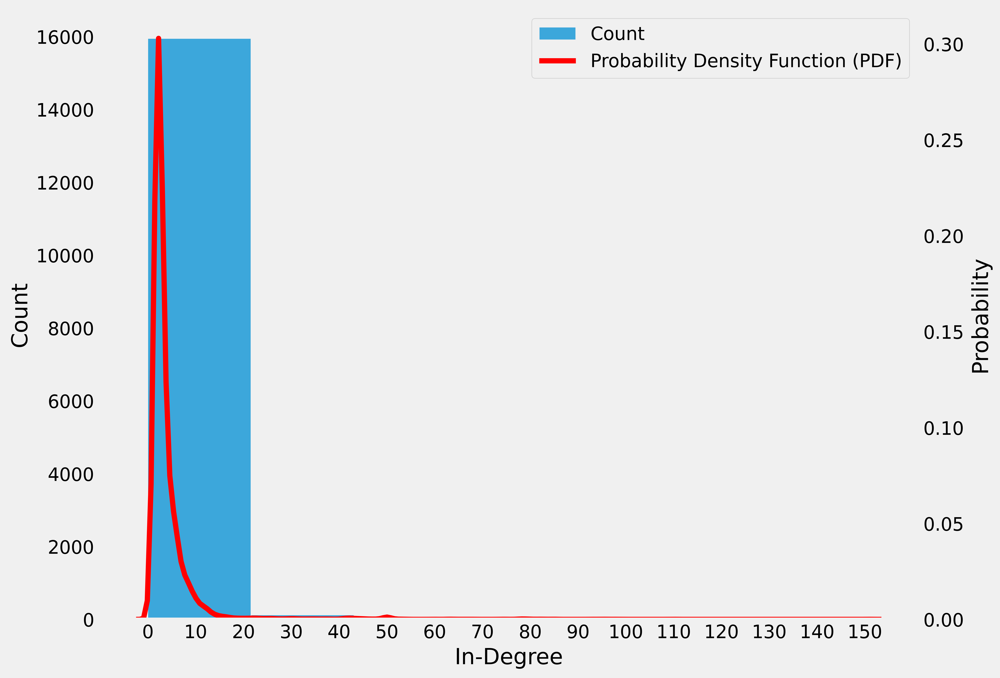
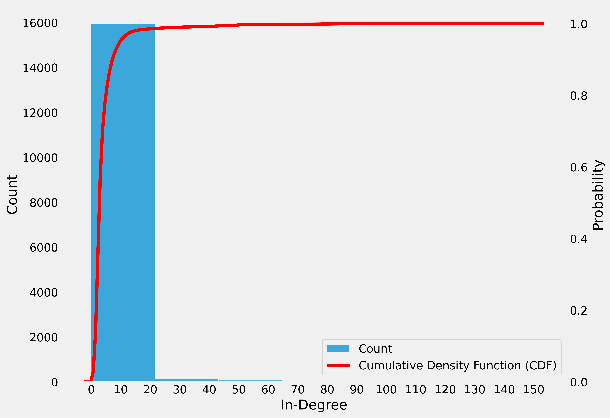
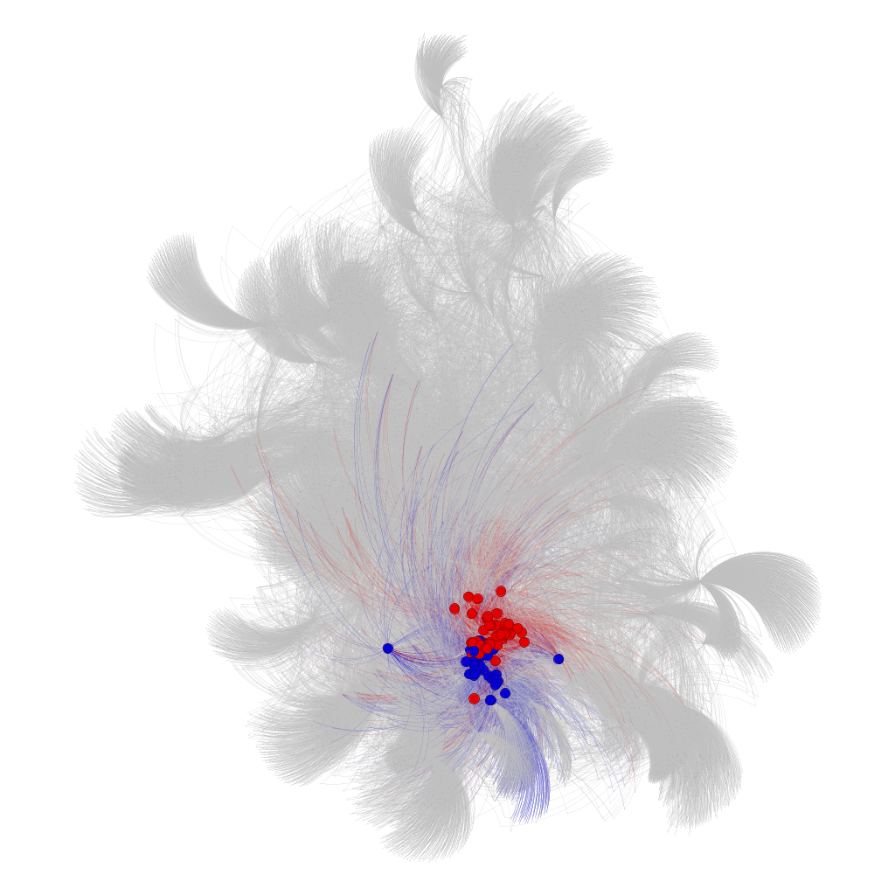

# Studying connections between classic RPGs using networks

 
In short, an RPG is a game in which a person tells a story that is enacted by the players who are given roles as the various pieces of background information. Challenges related to the story are then presented and must be addressed by all participants. Each player represents a character in the story and is attributed (quantitatively-defined) skills. These skills are tested during the game to decide if the character succeeds in his or her attempt to perform a task that solves the problem or overcomes the challenge [1].

 
Over the years, RPGs have been incorporated into the virtual world of video games. Dragon Age, Mass Effect and Baldur’s Gate were some of the first (and classic) titles released, which were later transformed into successful franchises. For this work, a network of links present on each of the Wikipedia pages referring to these franchises was created, in an attempt to investigate the relationship between them. It is important to highlight that due to machine limitations, only up to the second layer of links were analyzed.

 
The creation of the network is *detailed* in the notebook within the source folder.

  
  
  

  Figure 1. Dragon Age (google imgs)  | Figure 2. Mass Effect (google imgs)  | Figure 3. Baldur's Gate 3 (google imgs) 

 
In the figures below, there are graphs highlighting some of the main parameters for network analysis. Shades of blue and smaller sizes indicate lower values, while shades of red and larger sizes indicate higher values ​​for each parameter.

  
  
  
  

  Figure 4. In-Degree Centrality  | Figure 5. Closeness Centrality  | Figure 6. Betweness Centrality  | Figure 7. Eigenvector Centrality 

 
In figure 4, there is the graph representation for In-Degree Centrality. It can be seen that among the pages with the highest in-degree rates are the pages of IGN, Bioware and Eletronic Arts. The in-degree metric, in this case, corresponds to the number of times this page was cited by others present in the graph. It makes sense that these three were mentioned a lot, since the three first games of these franchises were developed by the company Bioware, which has a connection with the distributor Eletronic Arts (EA), while IGN is a large website for promoting game releases.

 
In figure 5, there is the graph representation for Closeness Centrality. It can be seen that many pages showed high rates of closeness centrality, with a significant concentration on pages from magazines specialized in promoting game releases. This metric reveals that these pages are well positioned in the graph, allowing quick and efficient access to other pages. This result is expected, given the role of these magazines in connecting diverse information related to games, offering centralized access to varied content.

 
In figure 6, the graph representation for Betweenness Centrality highlights the YouTube, The Guardian, Dragon Age, William Shakespeare and Immanuel Kant pages as those with the highest betweenness centrality. These pages act as crucial bridges within the graph, facilitating the connection between different groups of pages. The prominence of these pages indicates their importance in the flow of information, connecting areas that would otherwise be more isolated within the network.

 
In figure 7, the graph representation for Eigenvector Centrality is presented. In this metric, only the Master of Arts (Scotland) page stood out significantly, indicating that, within the graph, this page is connected to others that also have high importance. This result may reflect the academic and cultural influence associated with the Master of Arts, positioning it as a central node in a network of pages related to topics of high intellectual relevance.

  
  

  Figure 8. Probability Density Function (PDF) of network  | Figure 9. Cumulative Density Function (CDF) of network 

  

  Figure 10. 92 K-core (red) and 76 K-shell (blue) 

 
In Figures 8 and 9, which show the network's Probability Density Function (PDF) and Cumulative Density Function (CDF), respectively, it is clear that most pages have a low In-degree, that is, they are rarely cited by other pages. While few pages have large numbers of citations. In Figure 10, where the group with k-core equal to 92 is seen in red and the group with k-shell equal to 76 in blue, two groups can be seen that have great influence on the network, either being cited or citing other pages. In Figures 8 and 9, which show the network's Probability Density Function (PDF) and Cumulative Density Function (CDF), respectively, it is clear that most pages have a low In-degree, that is, they are rarely cited by other pages. While few pages have large numbers of citations. 

 

  
In Figure 10, where the group with k-core equal to 92 is seen in red and the group with k-shell equal to 76 in blue, two groups can be seen that have great influence on the network, either being cited or citing other pages. When analyzing the region in red and blue, it was noticed that the interconnected pages were mostly pages related to characters and collectibles from the three games, which explains the high connection between them, in addition to their high influence on the network.

## License
This project is licensed under the MIT License. See the LICENSE file for details ([MIT](https://choosealicense.com/licenses/mit/)).

## 🔗 Links
[Youtube](https://youtube.com)

## References

[1] RANDI, M. A. F.; CARVALHO, H. F. DE .. Learning through role-playing games: an approach for active learning and teaching. Revista Brasileira de Educação Médica, v. 37, n. 1, p. 80–88, jan. 2013. 

[2] GEPHI. Gephi: The Open Graph Viz Platform. Versão 0.9.2. Paris: Gephi Consortium, 2021. Software. Disponível em: https://gephi.org/. Acesso em: 11 ago. 2024.

[3] NETWORKX. NetworkX: High productivity software for complex networks. Versão 3.1. [S.l.]: Python Software Foundation, 2024. Software. Disponível em: https://networkx.org/. Acesso em: 11 ago. 2024.
 

## 🚀 About me
If you have any questions or suggestions, please contact me.

Author: Josué Anuar Costa de Medeiros
Contact: josueanuarm@gmail.com

